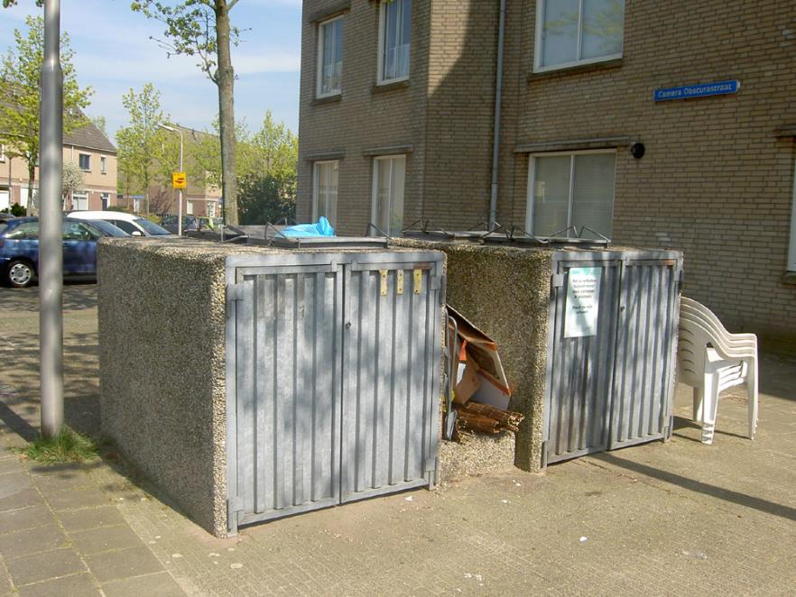

Bak (BAK) 
===

**Definitie**

Object met een permanent karakter dat dient om iets in te bergen of te
verzamelen.

type
----

**Definitie**

Het soort bak.

### afval apart plaats

**Definitie**

Boven- of ondergrondse opslagplaats voor het gescheiden inzamelen van afval, met
stortkoker(s) op het straatniveau.

**Verplicht?**

Nee, optionele inhoud IMGeo.

**Voorbeeld**

| **Bak**                | **Attribuutwaarde** | **Opmerkingen** |
|------------------------|---------------------|-----------------|
| type                   | afval apart plaats  |                 |
| relatieveHoogteligging |                     |                 |

### afvalbak

**Definitie**

Bak of korf in de openbare ruimte met een permanent karakter; bedoeld voor het
verzamelen van (meestal los) afval.

**Verplicht?**

Nee, optionele inhoud IMGeo.

**Voorbeeld**

| **Bak**                | **Attribuutwaarde** | **Opmerkingen** |
|------------------------|---------------------|-----------------|
| type                   | afvalbak            |                 |
| relatieveHoogteligging |                     |                 |

### drinkbak

**Definitie**

Bak gevuld met water, waaruit vee of wild kan drinken.

**Verplicht?**

Nee, optionele inhoud IMGeo.

**Voorbeeld**

| **Bak**                | **Attribuutwaarde** | **Opmerkingen** |
|------------------------|---------------------|-----------------|
| type                   | drinkbak            |                 |
| relatieveHoogteligging |                     |                 |

### bloembak

**Definitie**

Bak in de openbare ruimte met een permanent karakter, waarin planten of struiken
zijn geplant.

**Verplicht?**

Nee, optionele inhoud IMGeo.

**Voorbeeld**

| **Bak**                | **Attribuutwaarde** | **Opmerkingen** |
|------------------------|---------------------|-----------------|
| type                   | bloembak            |                 |
| relatieveHoogteligging |                     |                 |

### zand- / zoutbak

**Definitie**

Een bak met strooisel ten behoeve van gladheidsbestrijding.

**Verplicht?**

Nee, optionele inhoud IMGeo.

**Voorbeeld**

| **Bak**                | **Attribuutwaarde** | **Opmerkingen** |
|------------------------|---------------------|-----------------|
| type                   | zand- / zoutbak     |                 |
| relatieveHoogteligging |                     |                 |

### container

**Definitie**

Nagelvast met de grond verbonden inzamelmiddel voor afvalstoffen, doorgaans van
metaal of kunststof waarin afvalstoffen worden verzameld, bewaard en waaruit
deze afvalstoffen vervolgens worden overgeladen in een inzamelvoertuig.

**Verplicht?**

Nee, optionele inhoud IMGeo.

**Voorbeeld**

| **Bak**                | **Attribuutwaarde** | **Opmerkingen** |
|------------------------|---------------------|-----------------|
| type                   | container           |                 |
| relatieveHoogteligging |                     |                 |
