# Wegdeel

**Definitie**

Kleinste functioneel onafhankelijk stukje van een NEN 3610 Weg met
gelijkblijvende, homogene eigenschappen en relaties en primair bedoeld voor
gebruik door weg-, spoor- en vliegverkeer te land.

## inwinningsregels

### BGT

Bron: [Gegevenscatalogus BGT 1.2](https://docs.geostandaarden.nl/imgeo/catalogus/bgt/#objectafbakening-wegdeel)

>   **Indeling**
>
>   Om de wegdelen in te delen wordt een ordeningsprincipe gehanteerd. De
>   verzameling wegdelen wordt ingedeeld naar de functie van het wegdeel en naar
>   het fysieke voorkomen.
>
>   Het attribuut fysiek voorkomen geldt voor het gehele wegdeel. Een overgang
>   van fysiek voorkomen is dus altijd ook een grens tussen twee wegdelen. Het
>   gaat hierbij over het voorkomen waarmee het wegdeel overwegend is bedekt.
>   Voor minimale stukjes, 5m2, met andere verharding hoeft geen apart wegdeel
>   te worden gevormd.
>
>   **Regels voor opname**
>
>   Bestrate gedeelten in voor- en achtertuinen van panden worden beschouwd als
>   onderdeel van het erf (onbegroeid terreindeel) en worden niet nader
>   ingewonnen.
>
>   Brandgangen, met een openbaar karakter en waarvan de breedte \>0,90 m
>   bedraagt, worden opgenomen tot de bebouwingslijn van gebouwen als wegdeel
>   type voetpad. Brandgangen met een ontsluitingsfunctie van kennelijk openbaar
>   terrein worden altijd opgenomen.
>
>   
>
>   De kruinlijn moet bij het wegdeel worden opgenomen indien de helling een
>   verhouding heeft van verticaal:horizontaal van 1:4 of steiler en het
>   hoogteverschil \> 1 m bedraagt.
>
>   Eén van de zijden van het wegdeel valt altijd samen met de kruinlijn, zijnde
>   bovenkant talud. De coördinaten van de kruinlijn zijn identiek met die van
>   de objectbegrenzing ter plaatse. Het gedeelte van een object dat op het
>   talud ligt, is altijd een apart begrensd vlak ten opzichte van het deel van
>   het object dat niet op het talud ligt.
>
>   Als er meer dan een objecttype op een talud ligt, bevat alleen het hoogst
>   gelegen object een kruinlijngeometrie. De coördinaten van de kruinlijn zijn
>   identiek aan de coördinaten van de objectbegrenzing die samenvalt met de
>   kruinlijn.
>
>   **Aandachtspunten**
>
>   Het begin van een wegdeel van een auto(snel)weg wordt aangegeven middels een
>   bord G01 (autosnelweg) en G03 (autoweg). Dit kan zijn ter plaatse van een
>   kruispunt. In de praktijk staat zo'n bord nooit precies op het kruispunt,
>   maar enkele meter verder, de praktische werking van het bord geldt vanaf dat
>   kruispunt.
>
>   Een autosnelweg kan ook beginnen zonder dat er kruispunt aanwezig is.
>
>   Het beëindigen van een wegdeel van een auto(snel)weg kan gebeuren door een
>   bord G2 (einde autosnelweg) of G04 (einde autoweg). Een autoweg kan ook
>   eindigen bij een kruispunt. Het bord G03 moet namelijk ná elk kruispunt
>   worden herhaald.
>
>   Een autosnelweg kan ook eindigen zonder aanwezig kruispunt. Dan wordt het
>   bord G2 gebruikt en gaat de weg over in een regionale weg.
>
>   Bij een autoweg is er sprake van een, meestal fysieke, scheiding tussen
>   langzaam verkeer en snelverkeer.
>
>   Samenvattend geldt dat voor het begin en einde van een wegdeel van een
>   auto(snel)weg de plaats van het bord bepalend is, op basis van de betekenis
>   in het RVV 1990.
>
>   Molgoten langs wegdelen maken deel uit van dat wegdeel, ook als zij uit een
>   andere ver­harding bestaan. De buitenzijde van de molgoot vormt de
>   begrenzing van het wegdeel met vrijwel gelijke hoogte.
>
>   Een afsluitende band hoort bij het wegdeel, verkeerseiland of berm dat
>   gelijk ligt met de bovenzijde van de band.
>
>   Fietspaden vormen BGT inhoud indien aangeduid met een blauw bord met daarop
>   een wit rijwiel (bord G11 of G12a), of een blauw of zwart bord met daarop de
>   tekst “FIETSPAD” of “RIJWIELPAD” (bord G13). In IMGeo mogen stroken
>   oranjekleurige verharding voorzien van een wit rijwielsymbool worden
>   opgenomen als fietspad.
>
>   Aaneengesloten parkeervakken die zijn bedoeld voor één voertuig, worden
>   ingewonnen als één aaneengesloten wegdeel waarbij functieWeg de waarde
>   ‘parkeervlak’ heeft.
>
>   Uitsparingen in wegdelen, meestal van het type voetpad, voor stedelijk groen
>   worden niet afzonderlijk ingwonnen indien \<5 m2. Het wegdeel wordt daarbij
>   geacht door te lopen.
>
>   Belijning, kleur en symboliek zijn geen begrenzingen van wegdelen, zoals
>   rijbanen, OV-banen en parkeervakken. Een uitzondering geldt voor de
>   oranjekleurige fietsstroken voorzien van een wit rijwielsymbool. Deze worden
>   ingewonnen als fietspad.
>
>   Inritten (toegangswegen, oprijlanen) naar erven en terreinen vormen BGT
>   inhoud wanneer ze langer zijn dan 25 m. Kortere inritten kunnen worden
>   opgenomen in IMGeo.

### IMGeo

Bron: [Gegevenscatalogus IMGeo 2.2](https://docs.geostandaarden.nl/imgeo/catalogus/imgeo/#wegdeel-en-weginrichting)

>   Ten behoeve van beheer kan een BGT wegdeel uit meerdere beheereenheden
>   bestaan. Men mag deze zo afbakenen als voor beheer gewenst is. Voor levering
>   conform BGT of IMGeo moeten voor de attributen de BGT respectievelijk
>   IMGeo-domeinwaarden zijn ingevuld.
>
>   In IMGeo kunnen inrichtingselementen, die op wegdelen voorkomen, worden
>   opgenomen met het objecttype weginrichtingselement.
>
>   Lijnafwatering wordt opgenomen als lijnobject. Geleideconstructie kan worden
>   opgenomen als punt-, lijn- of vlakobject. Wegmarkeringen worden opgenomen
>   als lijnobject als het gaat om belijning, en als puntobject als het gaat om
>   symbolen op het wegdek.
>
>   Wildrooster en rooster worden opgenomen als punt-, lijn- of vlakobject.
>
>   Grasklinkers die onderdeel zijn van een wegdeel kunnen worden opgenomen met
>   fysiek voorkomen ‘half verhard: grasklinkers’.
>
>   In de BGT maken molgoten deel uit van een wegdeel. In IMGeo kunnen molgoten
>   worden opgenomen als Weginrichtingselement type molgoot (lijngeometrie).
>
>   In de BGT maakt een afsluitende band deel uit van een wegdeel,
>   verkeerseiland of berm. In IMGeo kan een band worden opgenomen als
>   Weginrichtingselement type geleideconstructie.
>
>   In IMGeo kunnen stroken oranjekleurige verharding voorzien van een wit
>   rijwielsymbool worden opgenomen als fietspad. Fietssuggestiestroken (zonder
>   wit rijwielsymbool) vormen geen inhoud van IMGeo.
>
>   In de BGT worden aaneengesloten parkeervakken ingewonnen als één wegdeel. In
>   IMGeo kunnen deze eventueel nader worden ingedeeld. Ook kan de belijning als
>   weginrichtingselement worden opgenomen.
>
>   In de BGT worden uitsparingen in wegdelen voor stedelijk groen niet apart
>   ingewonnen indien \< 5 m2. In IMGeo kunnen deze worden opgenomen als
>   ‘begroeid terreindeel groenvoorziening’.
>
>   Wegmarkeringen zoals symbolen, belijning en kleur zijn geen BGT inhoud maar
>   kunnen in IMGEO worden opgenomen als weginrichtingselement.
>
>   Inritten (toegangswegen, oprijlanen) naar erven en terreinen korter dan 25 m
>   kunnen worden opgenomen als IMGeo inhoud.

## functie

**Definitie**

Specificatie van het hoofdgebruiksdoel van het wegdeel.

### OV-baan

**Definitie**

Wegdeel dat uitsluitend is bestemd en gemarkeerd voor openbaar vervoer en
afgescheiden is van de andere wegdelen niet uitsluitend door markering.

**Verplicht?**

Ja, verplichte inhoud BGT.

**Voorbeeld**

A:

| **Wegdeel**            | **Attribuutwaarde** | **Opmerkingen** |
|------------------------|---------------------|-----------------|
| functie                | OV-baan             |                 |
| fysiekVoorkomen        | Gesloten verharding |                 |
| relatieveHoogteligging |  0                  |                 |

B en C: ondersteunend wegdeel: verkeerseiland, fysiek voorkomen: open
verharding, niveau 0.

D: wegdeel, voetpad, open verharding, niveau 0.

Omdat de afscheiding met de OV-baan bestaat uit belijning, zijn de fietsstroken
daarop geen BGT-inhoud.

A:

| **Wegdeel**            | **Attribuutwaarde**  | **Opmerkingen** |
|------------------------|----------------------|-----------------|
| functie                | OV-baan              |                 |
| fysiekVoorkomen        |  Gesloten verharding |                 |
| relatieveHoogteligging |  0                   |                 |

B en C: Begroeid terreindeel, Groenvoorziening.

D, E en F: Ondersteunend wegdeel: Verkeerseiland, fysiek voorkomen: open
verharding.

### overweg

**Definitie**

Een gelijkvloerse kruising van een wegdeel en een wegdeel type ov-baan met spoor
type trein of sneltram.

**Verplicht?**

Ja, verplichte inhoud BGT.

**Voorbeeld**

A:

| **Wegdeel**            | **Attribuutwaarde**  | **Opmerkingen** |
|------------------------|----------------------|-----------------|
| functie                | overweg              |                 |
| fysiekVoorkomen        |  Gesloten verharding |                 |
| relatieveHoogteligging |  0                   |                 |

B: Wegdeel, Spoorbaan.

C: Spoor, Trein.

### spoorbaan

**Definitie**

Gebaand gedeelte voor het verkeer over rails.

**Verplicht?**

Ja, verplichte inhoud BGT.

**Voorbeeld**

B:

| **Wegdeel**            | **Attribuutwaarde** | **Opmerkingen** |
|------------------------|---------------------|-----------------|
| functie                | spoorbaan           |                 |
| fysiekVoorkomen        |  Half verhard       |                 |
| relatieveHoogteligging |  0                  |                 |

A: Wegdeel, Overweg.

C: Spoor, Trein.

### baan voor vliegverkeer

**Definitie**

Wegdeel uitsluitend bedoeld voor vliegverkeer.

**Verplicht?**

Ja, verplichte inhoud BGT.

**Voorbeeld**

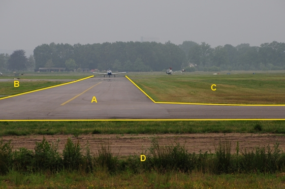

A:

| **Wegdeel**            | **Attribuutwaarde**    | **Opmerkingen** |
|------------------------|------------------------|-----------------|
| functie                | baan voor vliegverkeer |                 |
| fysiekVoorkomen        |  Gesloten verharding   |                 |
| relatieveHoogteligging |  0                     |                 |

B, C en D: Begroeid terreindeel, Grasland overig.

### rijbaan autosnelweg

**Definitie**

Wegdeel dat onderdeel is van een weg uitsluitend bestemd voor snelverkeer en met
gescheiden rijbanen en ongelijkvloerse kruisingen, daartoe aangeduid met het
betreffende verkeersbord.

**Verplicht?**

Ja, verplichte inhoud BGT.

**Voorbeeld**

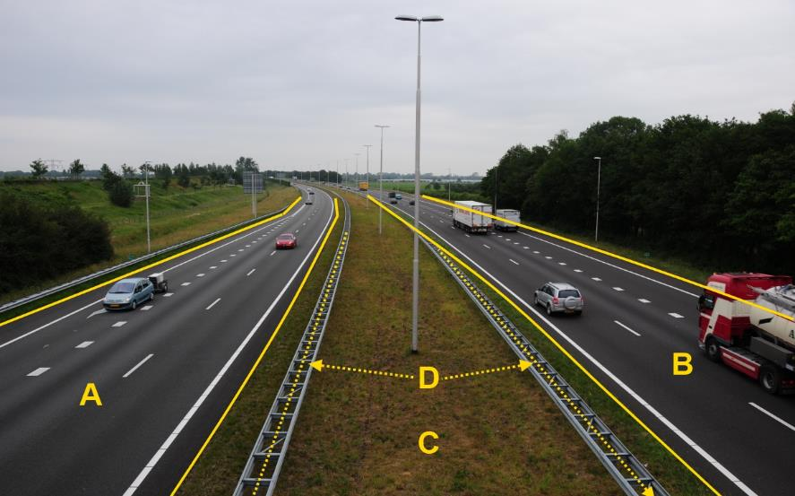

A en B:

| **Wegdeel**            | **Attribuutwaarde**  | **Opmerkingen** |
|------------------------|----------------------|-----------------|
| Functie                | rijbaan: autosnelweg |                 |
| fysiekVoorkomen        |  Gesloten verharding |                 |
| relatieveHoogteligging |  0                   |                 |

C: Ondersteunend wegdeel: Berm, fysiek voorkomen: Groenvoorziening.

D (meerdere objecten): IMGeo: Type weginrichting, Geleideconstructie.

#### verbindingsweg

**Definitie**

Een verbindingsweg is (in principe) een eenrichtingsweg, gelegen binnen een
knooppunt of aansluiting, die onderdeel is van de wijze waarop de
ongelijkvloersheid is gerealiseerd.

**Verplicht?**

Nee, optionele inhoud IMGeo.

**Voorbeeld**

A, B, C en D zijn in de BGT wegdelen autosnelweg, autoweg of regionale weg, in
IMGeo kunnen ze tevens worden geclassificeerd als: verbindingsweg

#### calamiteitendoorsteek

**Definitie**

Een (Calamiteiten doorsteek) CADO heeft tot doel het verkeer op een rijbaan via
een doorsteek van de weg te kunnen geleiden in geval van een calamiteit of
werkzaamheden op de rijbaan. Een tweede doel is het faciliteren van toegang tot
rijbanen voor hulpdiensten vanaf andere rijbanen of van een parallelweg.

**Verplicht?**

Nee, optionele inhoud IMGeo.

**Voorbeeld**

Een afbeelding van een calamiteitendoorsteek kunt u sturen
aan: [imgeo\@geonovum.nl](mailto:info@geonovum.nl)

Een (Calamiteiten doorsteek) CADO heeft tot doel het verkeer op een rijbaan via
een doorsteek van de weg te kunnen geleiden in geval van een calamiteit of
werkzaamheden op de rijbaan. Een tweede doel is het faciliteren van toegang tot
rijbanen voor hulpdiensten vanaf andere rijbanen of van een parallelweg.

### rijbaan autoweg

**Definitie**

Wegdeel dat onderdeel is van een weg uitsluitend bestemd voor snelverkeer,
daartoe aangeduid met het betreffende verkeersbord.

**Verplicht?**

Ja, verplichte inhoud BGT.

**Voorbeeld**

A:

| **Wegdeel**            | **Attribuutwaarde**  | **Opmerkingen** |
|------------------------|----------------------|-----------------|
| functie                | rijbaan: autoweg     |                 |
| fysiekVoorkomen        |  Gesloten verharding |                 |
| relatieveHoogteligging |  0                   |                 |

#### verbindingsweg

**Definitie**

Een verbindingsweg is (in principe) een eenrichtingsweg, gelegen binnen een
knooppunt of aansluiting, die onderdeel is van de wijze waarop de
ongelijkvloersheid is gerealiseerd.

**Verplicht?**

Nee, optionele inhoud IMGeo.

**Voorbeeld**

Zie verbindingsweg bij Wegdeel.

#### calamiteitendoorsteek

**Definitie**

Een (Calamiteiten doorsteek) CADO heeft tot doel het verkeer op een rijbaan via
een doorsteek van de weg te kunnen geleiden in geval van een calamiteit of
werkzaamheden op de rijbaan. Een tweede doel is het faciliteren van toegang tot
rijbanen voor hulpdiensten vanaf andere rijbanen of van een parallelweg.

**Verplicht?**

Nee, optionele inhoud IMGeo.

**Voorbeeld**

Een afbeelding van een calamiteitendoorsteek kunt u sturen
aan: [imgeo\@geonovum.nl](mailto:info@geonovum.nl)

Een (Calamiteiten doorsteek) CADO heeft tot doel het verkeer op een rijbaan via
een doorsteek van de weg te kunnen geleiden in geval van een calamiteit of
werkzaamheden op de rijbaan. Een tweede doel is het faciliteren van toegang tot
rijbanen voor hulpdiensten vanaf andere rijbanen of van een parallelweg.

### rijbaan regionale weg

**Definitie**

Wegdeel dat onderdeel is van een weg die een verbinding vormt tussen bewoonde
oorden of tussen wijken binnen een dorp of stad.

**Verplicht?**

Ja, verplichte inhoud BGT.

**Voorbeeld**

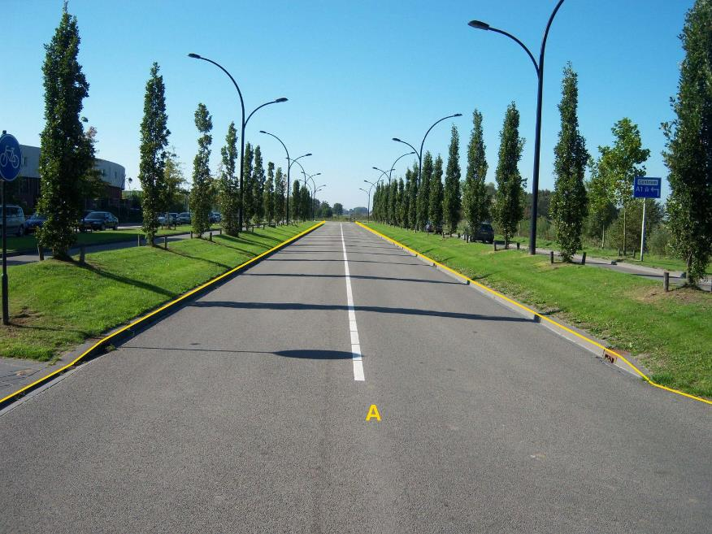

A:

| **Wegdeel**            | **Attribuutwaarde**    | **Opmerkingen** |
|------------------------|------------------------|-----------------|
| functie                | rijbaan: regionale weg |                 |
| fysiekVoorkomen        |  Gesloten verharding   |                 |
| relatieveHoogteligging |  0                     |                 |

#### verbindingsweg

**Definitie**

Een verbindingsweg is (in principe) een eenrichtingsweg, gelegen binnen een
knooppunt of aansluiting, die onderdeel is van de wijze waarop de
ongelijkvloersheid is gerealiseerd.

**Verplicht?**

Nee, optionele inhoud IMGeo.

**Voorbeeld**

Zie verbindingsweg bij Wegdeel.

#### verkeersdrempel

**Definitie**

Verhoging in een regionale rijbaan, bedoeld om het gemotoriseerde verkeer met
een lage snelheid te laten rijden.

**Verplicht?**

Nee, optionele inhoud IMGeo.

**Voorbeeld**

Zie verkeersdrempel bij Wegdeel.

### rijbaan lokale weg

**Definitie**

Wegdeel dat onderdeel is van een weg van lokaal belang.

**Verplicht?**

Ja, verplichte inhoud BGT.

**Voorbeeld**

A:

| **Wegdeel**            | **Attribuutwaarde**  | **Opmerkingen** |
|------------------------|----------------------|-----------------|
| functie                | rijbaan: lokale weg  |                 |
| fysiekVoorkomen        |  Gesloten verharding |                 |
| relatieveHoogteligging |  0                   |                 |

B: Wegdeel, Inrit.

C: Ondersteunend wegdeel: Berm, fysiek voorkomen: Groenvoorziening.

D: Begroeid terreindeel, Grasland agrarisch.

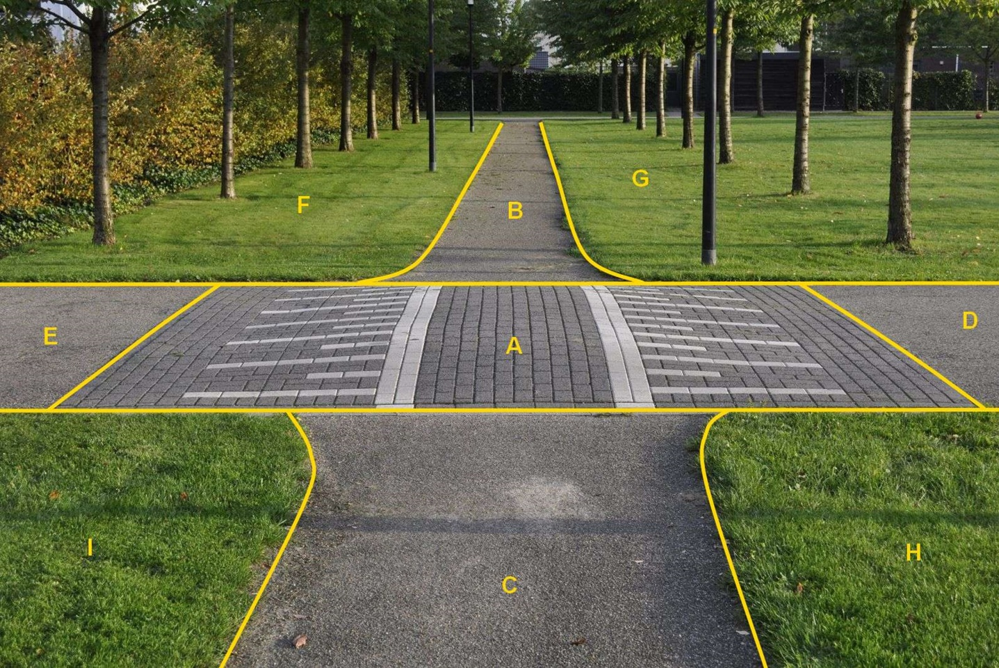

Het kruispunt, hier een verkeersdrempel, wordt niet apart ingewonnen maar is wel
zichtbaar omdat het een andere fysiek voorkomen heeft.

A:

| *Wegdeel*              | *Attribuutwaarde*   | *Opmerkingen* |
|------------------------|---------------------|---------------|
| functieWeg             | Rijbaan: lokale weg |               |
| fysiek voorkomen       | Open verharding     |               |
| relatieveHoogteligging |  0                  |               |

B en C: Wegdeel, Fietspad, Gesloten verharding.

E en D: Wegdeel, Rijbaan: Regionale weg, Gesloten verharding.

F, G, H en I: Begroeid terreindeel, Groenvoorziening.

#### verkeersdrempel

**Definitie**

Verhoging in een regionale rijbaan, bedoeld om het gemotoriseerde verkeer met
een lage snelheid te laten rijden.

**Verplicht?**

Nee, optionele inhoud IMGeo.

**Voorbeeld**

C:

| **Wegdeel**            | **Attribuutwaarde**                 | **Opmerkingen** |
|------------------------|-------------------------------------|-----------------|
| functie                | Rijbaan lokale weg: verkeersdrempel |                 |
| fysiekVoorkomen        |                                     |                 |
| relatieveHoogteligging |                                     |                 |

### fietspad

**Definitie**

Wegdeel met name bestemd voor fietsers en, indien toegestaan, bromfietsers en
dat afgescheiden is van de andere wegdelen niet uitsluitend door markering.

**Verplicht?**

Ja, verplichte inhoud BGT.

**Voorbeeld**

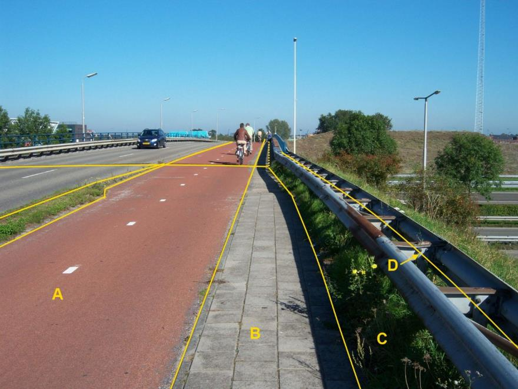

A:

| **Wegdeel**            | **Attribuutwaarde**  | **Opmerkingen** |
|------------------------|----------------------|-----------------|
| functie                | fietspad             |                 |
| fysiekVoorkomen        |  Gesloten verharding |                 |
| relatieveHoogteligging |  0                   |                 |

B: Wegdeel, Voetpad, Open verharding.

C: Ondersteunend wegdeel: Berm, fysiek voorkomen: Groenvoorziening.

D: IMGeo: Type weginrichting, Geleideconstructie.

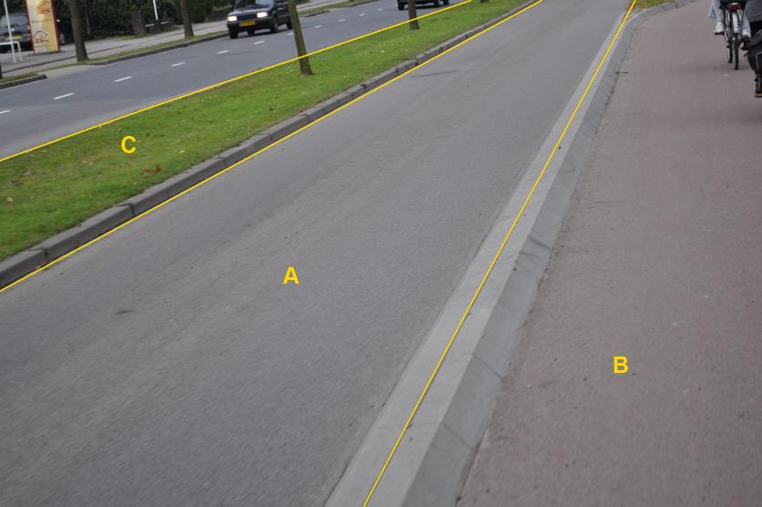

Fietspad is afgescheiden van de rijbaan: lokale weg vanwege band.

B:

| *Wegdeel*              | *Attribuutwaarde*   | *Opmerkingen* |
|------------------------|---------------------|---------------|
| functieWeg             | fietspad            |               |
| fysiek voorkomen       | Gesloten verharding |               |
| relatieveHoogteligging | 0                   |               |

A: Wegdeel, Rijbaan: lokale weg, Gesloten verharding.

C: Ondersteunend wegdeel: Berm, fysiek voorkomen: Groenvoorziening.

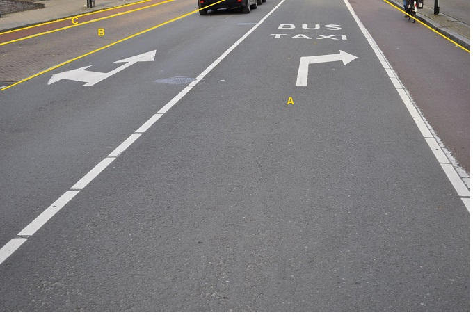

OV banen en fietspaden die zijn afgebakend door middel van belijning en/of
verkleuring vormen geen BGT inhoud en worden tot het wegdeel rijbaan: lokale weg
gerekend. Een wegdeel wordt uitsluitend als OV-baan geclassificeerd als het
alleen is bestemd voor openbaar vervoer en is afgescheiden van de andere
wegdelen niet uitsluitend door markering.

Wegdeel B heeft een andere fysiek voorkomen: open verharding.

A:

| *Wegdeel*              | *Attribuutwaarde*   | *Opmerkingen* |
|------------------------|---------------------|---------------|
| functieWeg             | Rijbaan: lokale weg |               |
| fysiek voorkomen       | Gesloten verharding |               |
| relatieveHoogteligging | 0                   |               |

### voetpad

**Definitie**

Wegdeel waar voetgangers gebruik van moeten maken.

**Verplicht?**

Ja, verplichte inhoud BGT.

**Voorbeeld**

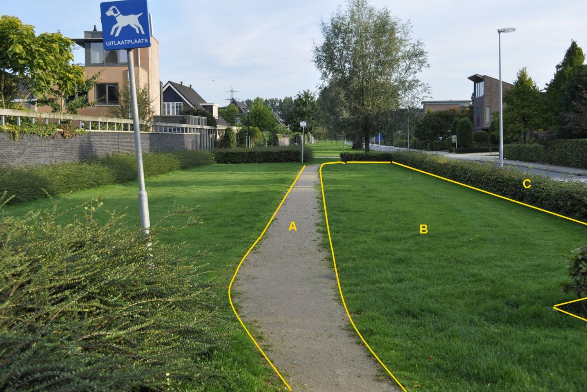

Voetpad is breder dan 0.30 m en wordt dus opgenomen.

Haag C wordt voor BGT niet geclassificeerd. Omdat het vak waarin de haag staat
groter is dan 5 m2 wordt het vak wel ingewonnen.

A:

| **Wegdeel**            | **Attribuutwaarde** | **Opmerkingen** |
|------------------------|---------------------|-----------------|
| Functie                | voetpad             |                 |
| fysiekVoorkomen        |  onverhard          |                 |
| relatieveHoogteligging |  0                  |                 |

B en C zijn voor de BGT beide: Begroeid terreindeel: Groenvoorziening.

C is voor IMGeo: Vegetatieobject: Haag.

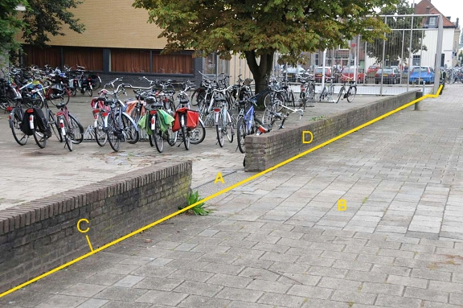

B:

| **Wegdeel**            | **Attribuutwaarde** | **Opmerkingen** |
|------------------------|---------------------|-----------------|
| Functie                | voetpad             |                 |
| fysiekVoorkomen        |  Open verharding    |                 |
| relatieveHoogteligging |  0                  |                 |

A: Onbegroeid terreindeel: Open verharding.

C en D: Scheiding, Muur.

Plantvak met boomspiegel is geen BGT inhoud want het is \< 5 m2, A loopt door.

A:

| *Wegdeel*              | *Attribuutwaarde* | *Opmerkingen* |
|------------------------|-------------------|---------------|
| functieWeg             | Voetpad           |               |
| fysiek voorkomen       | Open verharding   |               |
| relatieveHoogteligging |  0                |               |

B: Wegdeel, Rijbaan: Lokale weg, Open verharding

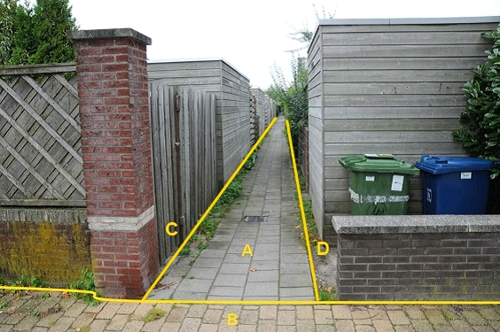

A en B:

| **Wegdeel**            | **Attribuutwaarde** | **Opmerkingen** |
|------------------------|---------------------|-----------------|
| fysiekVoorkomen        | voetpad             |                 |
| relatieveHoogteligging |  0                  |                 |

C en D: onbegroeid terreindeel, erf.

### voetpad op trap

**Definitie**

Voetpad op verkeersinfrastructurele voorziening bestaande uit een constructie
van treden, waarop men een hoger of lager gelegen plaats kan bereiken.

**Verplicht?**

Ja, verplichte inhoud BGT.

**Voorbeeld**

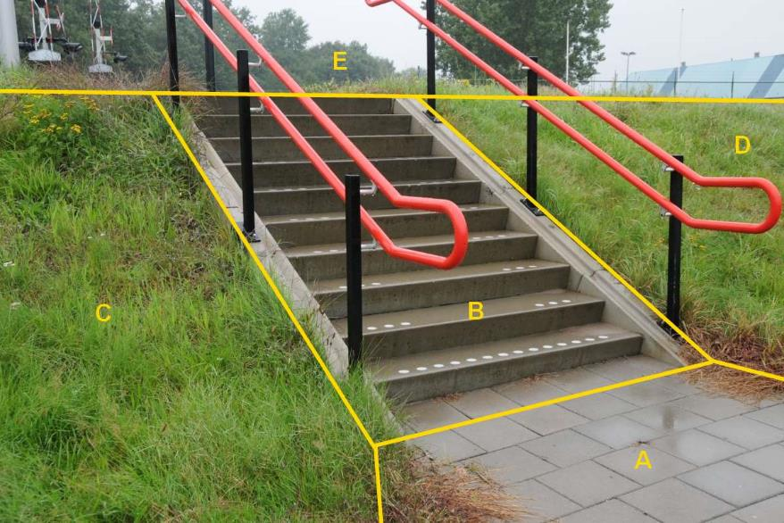

B:

| **Wegdeel**            | **Attribuutwaarde** | **Opmerkingen** |
|------------------------|---------------------|-----------------|
| functie                | Voetpad op trap     |                 |
| relatieveHoogteligging |   0                 |                 |

A: wegdeel, voetpad.

C en D: Begroeid terreindeel, talud, kruinlijngeometrie, niveau 0.

### ruiterpad

**Definitie**

Een wegdeel primair aangelegd voor het gebruik door ruiters.

**Verplicht?**

Ja, verplichte inhoud BGT.

**Voorbeeld**

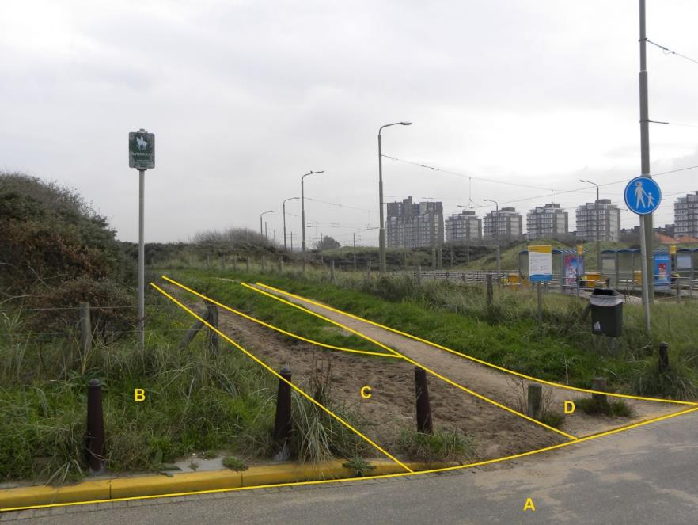

C:

| **Wegdeel**            | **Attribuutwaarde** | **Opmerkingen** |
|------------------------|---------------------|-----------------|
| functie                | ruiterpad           |                 |
| fysiekVoorkomen        |  onverhard          |                 |
| relatieveHoogteligging |  0                  |                 |

A: Wegdeel, Rijbaan: Lokale weg, Gesloten verharding

B: Begroeid terreindeel, Duin.

D: Wegdeel, Voetpad, Half verhard.

### parkeervlak

**Definitie**

Wegdeel bestemd voor het parkeren van motorvoertuigen.

**Verplicht?**

Ja, verplichte inhoud BGT.

**Voorbeeld**

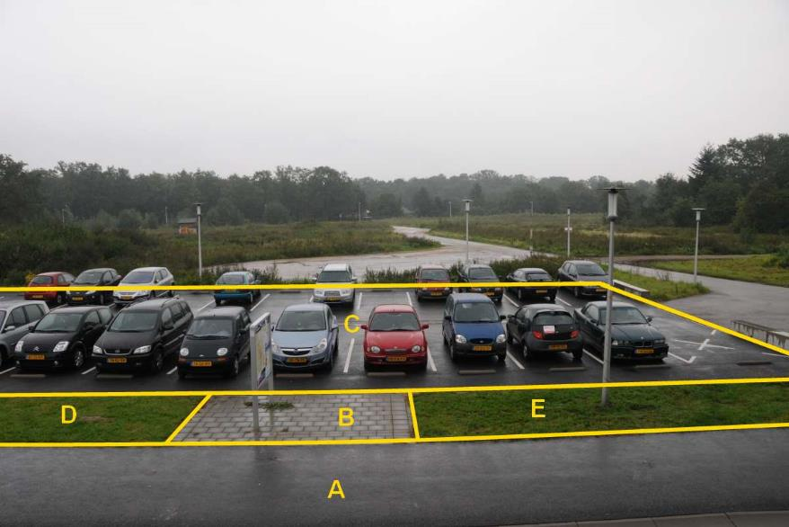

C:

| **Wegdeel**            | **Attribuutwaarde**  | **Opmerkingen** |
|------------------------|----------------------|-----------------|
| Functie                | parkeervlak          |                 |
| fysiekVoorkomen        |  Gesloten verharding |                 |
| relatieveHoogteligging |  0                   |                 |

A: Wegdeel, Fietspad, Gesloten verharding.

B: Wegdeel, Voetpad, Open verharding.

D en E: Ondersteunend wegdeel: Berm, fysiek voorkomen: Groenvoorziening.

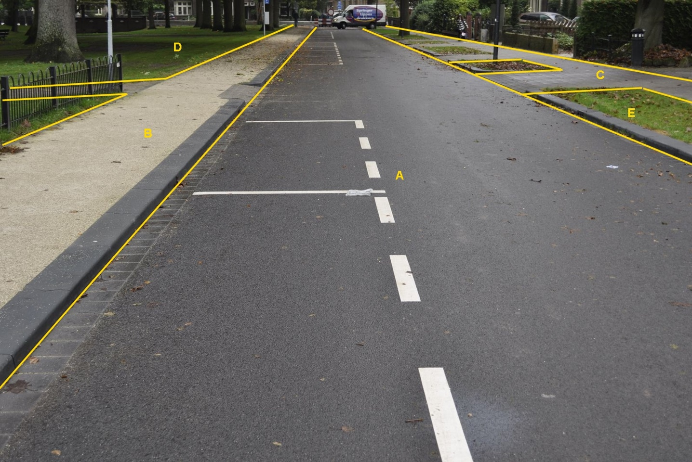

Parkeervlakken die met belijning zijn afgebakend, vormen géén BGT inhoud.

A:

| *Wegdeel*              | *Attribuutwaarde*   | *Opmerkingen* |
|------------------------|---------------------|---------------|
| functieWeg             | Rijbaan: lokale weg |               |
| fysiek voorkomen       | Gesloten verharding |               |
| relatieveHoogteligging | 0                   |               |

B en C: Wegdeel, Voetpad.

D: Begroeid terreindeel, Groenvoorziening.

E: Ondersteunend wegdeel: Berm, fysiek voorkomen: Groenvoorziening.

### voetgangersgebied

**Definitie**

Wegdeel alleen voor het gebruik door voetgangers, waarbij het door voetgangers
te gebruiken gebied de volle breedte van de weg beslaat en het gebied een
nadrukkelijk openbaar karakter heeft.

**Verplicht?**

Ja, verplichte inhoud BGT.

**Voorbeeld**

B en C:

| **Wegdeel**            | **Attribuutwaarde**                | **Opmerkingen** |
|------------------------|------------------------------------|-----------------|
| functie                | voetgangersgebied                  |                 |
| fysiekVoorkomen        |  B: open verharding, C: gesl.verh. |                 |
| relatieveHoogteligging |  0                                 |                 |

A en D: Pand

E: Wegdeel, Rijbaan: Lokale weg, Open verharding.

### inrit

**Definitie**

Toegangswegen, oprijlanen en dergelijke met verkeersfunctie die leiden naar
erven en terreinen.

**Verplicht?**

Ja, verplichte inhoud BGT.

**Voorbeeld**

B:

| **Wegdeel**            | **Attribuutwaarde**  | **Opmerkingen** |
|------------------------|----------------------|-----------------|
| functie                | inrit                |                 |
| fysiekVoorkomen        |  Gesloten verharding |                 |
| relatieveHoogteligging |  0                   |                 |

A: Wegdeel, Rijbaan, Regionale weg, Gesloten verharding.

C: Ondersteunend wegdeel: Berm, fysiek voorkomen: Groenvoorziening.

### woonerf

**Definitie**

Wegdeel waar de verblijfsfunctie (lopen, spelen, ontmoeten enzovoorts)
prioriteit heeft boven de verkeersfunctie.

**Verplicht?**

Ja, verplichte inhoud BGT.

**Voorbeeld**

Het woonerf wordt hier begrensd door de panden en bevat geen afzonderlijk
voetpad.

A:

| **Wegdeel**            | **Attribuutwaarde** | **Opmerkingen** |
|------------------------|---------------------|-----------------|
| functie                | woonerf             |                 |
| fysiekVoorkomen        |  Open verharding    |                 |
| relatieveHoogteligging |  0                  |                 |

De perken met groenvoorziening zijn \< 5m2 en daarom eventueel IMGeo inhoud.

## fysiekvoorkomen

**Definitie**

Mate waarin het wegdeel al of niet verhard is.

### gesloten verharding

**Definitie**

Verharding bestaande uit een materiaal dat niet verwijderbaar is zonder
definitieve destructie, zoals bijvoorbeeld bitumen, cement of kunststof.

**Verplicht?**

Ja, verplichte inhoud BGT.

**Voorbeeld**

B en D (afzonderlijke objecten):

| *Wegdeel*              | *Attribuutwaarde*   | *Opmerkingen* |
|------------------------|---------------------|---------------|
| functieWeg             | Rijbaan: lokale weg |               |
| fysiek voorkomen       | Gesloten verharding |               |
| relatieveHoogteligging | 0                   |               |

A: Wegdeel, Voetpad, Open verharding.

C: op volgende bladzijde.

E: Begroeid terreindeel, Groenvoorziening.

#### asfalt

**Definitie**

Gesloten verharding bestaande uit asfaltbeton of andere met bitumen gebonden
materialen.

**Verplicht?**

Nee, optionele inhoud IMGeo.

**Voorbeeld**

| **Wegdeel**            | **Attribuutwaarde**               | **Opmerkingen** |
|------------------------|-----------------------------------|-----------------|
| functie                |                                   |                 |
| fysiekVoorkomen        | gesloten fysiek voorkomen: asfalt |                 |
| relatieveHoogteligging |                                   |                 |

#### cementbeton

**Definitie**

Gesloten verharding bestaande uit gewapend of ongewapend beton.

**Verplicht?**

Nee, optionele inhoud IMGeo.

**Voorbeeld**

| **Wegdeel**            | **Attribuutwaarde**              | **Opmerkingen** |
|------------------------|----------------------------------|-----------------|
| functie                |                                  |                 |
| fysiekVoorkomen        | gesloten verharding: cementbeton |                 |
| relatieveHoogteligging |                                  |                 |

### open verharding

**Definitie**

Verharding gevormd door in verband aangebrachte elementen van beperkte
afmetingen, zoals bijvoorbeeld klinkers en tegels.

**Verplicht?**

Ja, verplichte inhoud BGT.

**Voorbeeld**

C:

| **Wegdeel**            | **Attribuutwaarde**  | **Opmerkingen** |
|------------------------|----------------------|-----------------|
| functie                |  Rijbaan: lokale weg |                 |
| fysiekVoorkomen        | open verharding      |                 |
| relatieveHoogteligging |  0                   |                 |

Overige letters op vorige bladzijde.

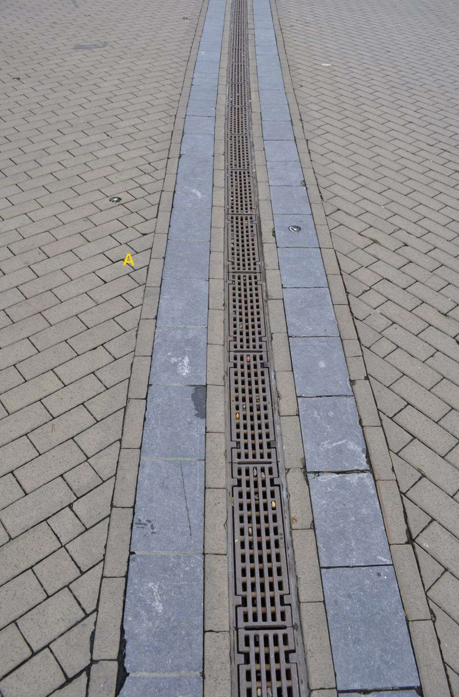

Goten vormen geen BGT inhoud en worden gerekend tot het wegdeel waar ze in
liggen.

Zebrapad heeft hetzelfde fysiek voorkomen als rest wegdeel en hoort daarom voor
de BGT bij A.

A:

| *Wegdeel*              | *Attribuutwaarde*   | *Opmerkingen* |
|------------------------|---------------------|---------------|
| functieWeg             | Rijbaan: lokale weg |               |
| fysiek voorkomen       | open verharding     |               |
| relatieveHoogteligging | 0                   |               |

#### betonstraatstenen

**Definitie**

Verharding gemaakt van betonstraatstenen. Straatsteen die als goedkope
vervanging van de gebakken klinkers is ontwikkeld.

**Verplicht?**

Nee, optionele inhoud IMGeo.

**Voorbeeld**

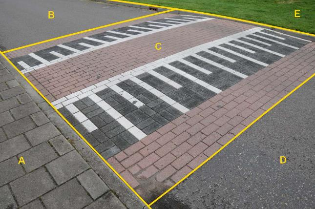

C:

| **Wegdeel**            | **Attribuutwaarde**                | **Opmerkingen** |
|------------------------|------------------------------------|-----------------|
| functie                |                                    |                 |
| fysiekVoorkomen        | open verharding: betonstraatstenen |                 |
| relatieveHoogteligging |                                    |                 |

#### gebakken klinkers

**Definitie**

Verharding gemaakt van straatbakstenen. Gebakken klinkers worden voornamelijk
geproduceerd uit grondstof van eigen bodem – de beddingen van onze rivieren.

**Verplicht?**

Nee, optionele inhoud IMGeo.

**Voorbeeld**

| **Wegdeel**            | **Attribuutwaarde**                | **Opmerkingen** |
|------------------------|------------------------------------|-----------------|
| functie                |                                    |                 |
| fysiekVoorkomen        | open verharding: gebakken klinkers |                 |
| relatieveHoogteligging |                                    |                 |

#### tegels

**Definitie**

Bestrating van tegels, een platte vaak vierkante betonnen steen; veelal gebruikt
voor trottoirbestrating.

**Verplicht?**

Nee, optionele inhoud IMGeo.

**Voorbeeld**

A:

| **Wegdeel**            | **Attribuutwaarde**     | **Opmerkingen** |
|------------------------|-------------------------|-----------------|
| functie                |                         |                 |
| fysiekVoorkomen        | open verharding: tegels |                 |
| relatieveHoogteligging |                         |                 |

#### sierbestrating

**Definitie**

Bestrating, uitgevoerd in verschillende bestratingsverbanden en -materialen, of
in een sierverband, die vooral wordt toegepast uit esthetische overwegingen.

**Verplicht?**

Nee, optionele inhoud IMGeo.

**Voorbeeld**

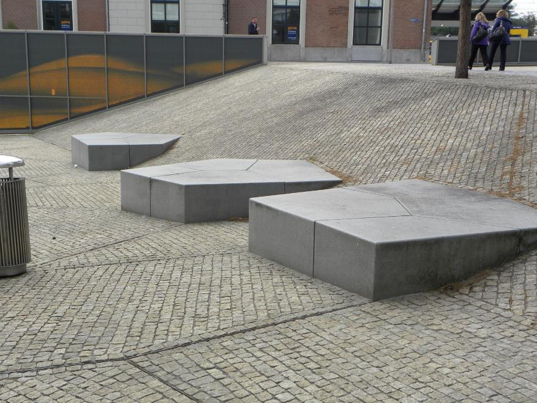

| **Wegdeel**            | **Attribuutwaarde**             | **Opmerkingen** |
|------------------------|---------------------------------|-----------------|
| functie                |                                 |                 |
| fysiekVoorkomen        | open verharding: sierbestrating |                 |
| relatieveHoogteligging |                                 |                 |

#### beton element

**Definitie**

Geprepareerde elementen van beton zoals, trottoirbanden, opsluitbanden en
stelconplaten.

**Verplicht?**

Nee, optionele inhoud IMGeo.

**Voorbeeld**

Een afbeelding van beton element kunt u sturen
aan: [imgeo\@geonovum.nl](mailto:info@geonovum.nl)

| **Wegdeel**            | **Attribuutwaarde**            | **Opmerkingen** |
|------------------------|--------------------------------|-----------------|
| functie                |                                |                 |
| fysiekVoorkomen        | open verharding: beton element |                 |
| relatieveHoogteligging |                                |                 |

### half verhard

**Definitie**

Verharding bestaande uit een door verdichting gebonden materiaal, of
onsamenhangend materiaal.

**Verplicht?**

Ja, verplichte inhoud BGT.

**Voorbeeld**

A:

| **Wegdeel**            | **Attribuutwaarde** | **Opmerkingen** |
|------------------------|---------------------|-----------------|
| functie                |  voetpad            |                 |
| fysiekVoorkomen        | half verhard        |                 |
| relatieveHoogteligging |  0                  |                 |

#### grasklinkers

**Definitie**

Elementenverharding bestaande uit elementen van beperkte afmetingen die ten
behoeve van de doorgroei van grassen en kruiden, zijn voorzien van openingen of
met tussenruimten aangebracht.

**Verplicht?**

Nee, optionele inhoud IMGeo.

**Voorbeeld**

| **Wegdeel**            | **Attribuutwaarde**      | **Opmerkingen** |
|------------------------|--------------------------|-----------------|
| functie                |                          |                 |
| fysiekVoorkomen        | half verhard: groensteen |                 |
| relatieveHoogteligging |                          |                 |

#### schelpen

**Definitie**

Ongebonden verharding bestaande uit schelpenmateriaal.

**Verplicht?**

Nee, optionele inhoud IMGeo.

**Voorbeeld**

| **Wegdeel**            | **Attribuutwaarde**    | **Opmerkingen** |
|------------------------|------------------------|-----------------|
| functie                |                        |                 |
| fysiekVoorkomen        | half verhard: schelpen |                 |
| relatieveHoogteligging |                        |                 |

#### puin

**Definitie**

Puin is afvalmateriaal dat bestaat uit losse brokstukken, grotendeels bestaande
uit stenen en beton, van gesloopte of ingestorte gebouwen, viaducten, bruggen en
andere objecten.

**Verplicht?**

Nee, optionele inhoud IMGeo.

**Voorbeeld**

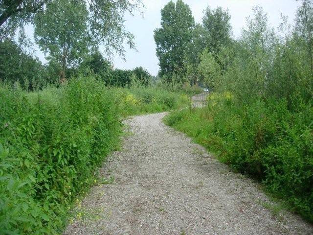

| **Wegdeel**            | **Attribuutwaarde** | **Opmerkingen** |
|------------------------|---------------------|-----------------|
| functie                |                     |                 |
| fysiekVoorkomen        | half verhard: puin  |                 |
| relatieveHoogteligging |                     |                 |

#### grind

**Definitie**

Ongebonden verharding bestaande uit kiezelmateriaal, waarvan de stenen in
doorsnede variëren van 1 tot 5 cm.

**Verplicht?**

Nee, optionele inhoud IMGeo.

**Voorbeeld**

| **Wegdeel**            | **Attribuutwaarde** | **Opmerkingen** |
|------------------------|---------------------|-----------------|
| functie                |                     |                 |
| fysiekVoorkomen        | half verhard: grind |                 |
| relatieveHoogteligging |                     |                 |

#### gravel

**Definitie**

Gravel is een ondergrond van gemalen baksteen die veel wordt gebruikt bij tennis
en ook wel op atletiekbanen.

**Verplicht?**

Nee, optionele inhoud IMGeo.

**Voorbeeld**

| **Wegdeel**            | **Attribuutwaarde**  | **Opmerkingen** |
|------------------------|----------------------|-----------------|
| functie                |                      |                 |
| fysiekVoorkomen        | half verhard: gravel |                 |
| relatieveHoogteligging |                      |                 |

### onverhard

**Definitie**

Wegdelen waar geen verharding of aaneengesloten vegetatie aanwezig is.

**Verplicht?**

Ja, verplichte inhoud BGT.

**Voorbeeld**

A:

| **Wegdeel**            | **Attribuutwaarde**  | **Opmerkingen** |
|------------------------|----------------------|-----------------|
| functie                |  Rijbaan: lokale weg |                 |
| fysiekVoorkomen        | onverhard            |                 |
| relatieveHoogteligging |  0                   |                 |

#### boomschors

**Definitie**

Onverhard met als deklaag boomschors.

**Verplicht?**

Nee, optionele inhoud IMGeo.

**Voorbeeld**

| **Wegdeel**            | **Attribuutwaarde**   | **Opmerkingen** |
|------------------------|-----------------------|-----------------|
| functie                |                       |                 |
| fysiekVoorkomen        | onverhard: boomschors |                 |
| relatieveHoogteligging |                       |                 |

#### zand

**Definitie**

Onverhard met als deklaag zand.

**Verplicht?**

Nee, optionele inhoud IMGeo.

**Voorbeeld**

| **Wegdeel**            | **Attribuutwaarde** | **Opmerkingen** |
|------------------------|---------------------|-----------------|
| functie                |                     |                 |
| fysiekVoorkomen        | onverhard: zand     |                 |
| relatieveHoogteligging |                     |                 |
